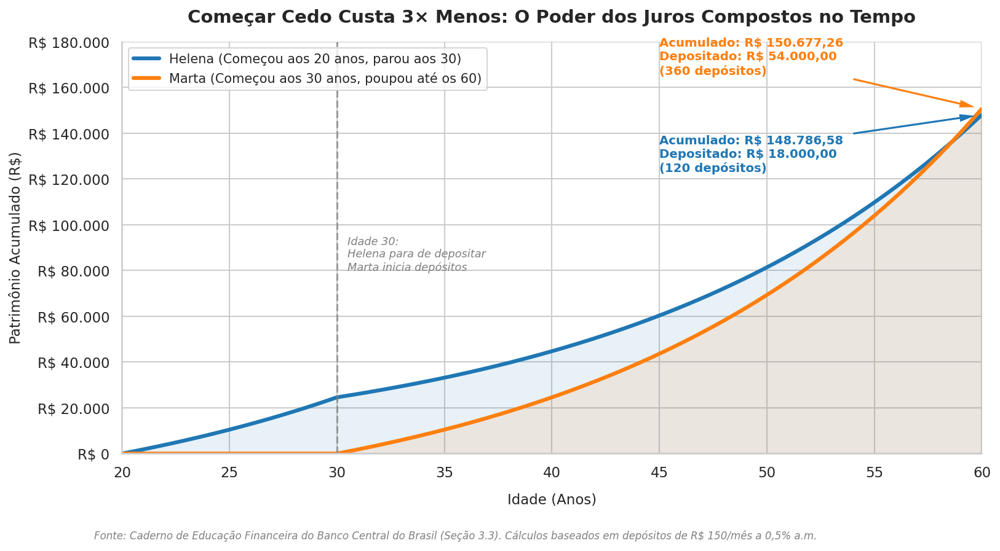

# 🚀 Repositório "Nota 10" - Letramento Financeiro & Autonomia para Carreiras em Tech

> 💡 **"Nada cai do céu. O esforço invisível de hoje é o alicerce da sua real autonomia de amanhã. E a única riqueza que ninguém, sob hipótese alguma, poderá arrancar de você é o seu aprendizado e a sua persistência."**

---

## 🎯 Contexto e Objetivos

Este repositório foi desenvolvido como o projeto final do caderno temático de **Alfabetização e Letramento Financeiro aplicado a Carreiras em Tecnologia (contextualizado com a plataforma DIO.PRO)**. 

Em um mercado altamente dinâmico e cercado por constantes apelos de consumo (gadgets de última geração, setups gamers caros e promessas de enriquecimento rápido), o profissional de tecnologia iniciante ou em transição de carreira frequentemente se depara com graves desequilíbrios financeiros. Estatísticas oficiais do Banco Central revelam que **duas em cada três pessoas enfrentam dificuldades sérias para chegar ao fim do mês com seus rendimentos** [1].

### Nossos Objetivos de Estudo:
1. **Diferenciação Comportamental**: Discernir de forma fria e racional as verdadeiras necessidades dos desejos supérfluos alimentados pelo "marketing de sedução" [1].
2. **Custo de Oportunidade em Capital Humano**: Avaliar decisões de consumo com base no conceito de Custo de Oportunidade, entendendo que o tempo e o dinheiro investidos em qualificação estruturada (como a assinatura **DIO.PRO**) representam o desenvolvimento de um ativo indestrutível [1].
3. **Orçamento Superavitário**: Aplicar a regra de ouro inegociável de manter as despesas estritamente abaixo das receitas [1, 2].
4. **Princípio do "Pague-se Primeiro"**: Blindar a formação da **Reserva de Emergência** no exato instante em que as receitas entram na conta, eliminando a prática ineficaz de poupar apenas "o que sobra" [1].

---

## 📚 Curadoria de Fontes

Este projeto foi estritamente fundamentado em **5 fontes abertas de alta credibilidade**, emitidas por órgãos reguladores e supervisores do Sistema Financeiro Nacional (SFN) e do mercado de capitais no Brasil.

| # | Fonte | Tipo | Órgão/Instituição | Descrição |
|---|---|---|---|---|
| **1** | [Caderno de Educação Financeira (Gestão de Finanças Pessoais)](https://www.bcb.gov.br/content/cidadaniafinanceira/documentos_cidadania/Cuidando_do_seu_dinheiro_Gestao_de_Financas_Pessoais/caderno_cidadania_financeira.pdf) | PDF | Banco Central do Brasil (BCB) | Manual básico nacional sobre finanças comportamentais, focado na relação psicológica com o dinheiro, orçamento e uso consciente do crédito [1]. |
| **2** | [Guia CVM de Planejamento Financeiro](https://www.gov.br/investidor/pt-br/educacional/publicacoes-educacionais/guias/guia-de-planejamento-financeiro) | URL | Comissão de Valores Mobiliários (CVM) | Guia prático focado na organização das finanças pessoais, estabelecimento de metas realistas e planejamento de futuro [2]. |
| **3** | [Curso Gestão de Finanças Pessoais](https://www.escolavirtual.gov.br/curso/170) | URL | Escola Virtual Gov / BCB | Trilha de aprendizagem gratuita e certificada cobrindo crédito, endividamento, prevenção a riscos e consumo planejado [3]. |
| **4** | [Portal Vida e Dinheiro - Estratégia Nacional de Educação Financeira (ENEF)](https://www.gov.br/mj/pt-br/assuntos/seus-direitos/consumidor/defesadoconsumidor/ENEF) | URL | Secretaria Nacional do Consumidor (SENACON) / CONEF | Diretrizes de conscientização pública de educação financeira nacional, focadas no planejamento para a longevidade [5]. |
| **5** | Relatório de Pesquisa: Alfabetização Financeira | Markdown | Compilação de Pesquisa | Relatório consolidado gerado via Inteligência Artificial para cruzar e mapear os principais achados conceituais das fontes oficiais [4]. |

---

## 📈 Simulação Visual Programática: O Poder do Tempo

Como demonstração de maturidade técnica, criamos uma simulação matemática programática (via biblioteca Python `matplotlib` e `seaborn`) do clássico caso do Caderno do Banco Central: **Helena vs. Marta** [1].

### ⚖️ O Cenário de Acumulação:
*   **Helena (Início aos 20 anos)**: Poupa **R$ 150,00 por mês** durante 10 anos (120 meses). Do seu bolso saem **R$ 18.000,00**. Aos 30 anos, ela para de depositar, mas deixa o dinheiro rendendo a uma taxa conservadora de 0,5% a.m. até completar 60 anos [1]. **Patrimônio acumulado: R$ 148.786,58** [1].
*   **Marta (Início aos 30 anos)**: Só percebe a importância da poupança aos 30 anos [1]. Para atingir praticamente o mesmo saldo acumulado de Helena aos 60 anos, ela precisa depositar ininterruptamente **R$ 150,00 por mês durante 30 anos** (360 meses) [1]. Do seu bolso saem **R$ 54.000,00** (três vezes mais!) [1]. **Patrimônio acumulado: R$ 150.677,26** [1].

*O gráfico comprova o poder avassalador dos juros compostos ao longo do tempo. Começar cedo permite que o tempo seja o principal impulsionador do acúmulo, diminuindo o esforço do bolso individual em 3 vezes (R$ 18k vs. R$ 54k) [1].*

---

## 💡 Mentalidade de Guerra: Esforço, Estudo e Ativos Indestrutíveis

A realidade financeira nos diz que **nada cai do céu** e o sistema econômico ao nosso redor lucra com a ignorância e o endividamento por impulso. A transição de carreira, o estudo árduo e o progresso em tecnologia não acontecem de forma passiva:
*   **O Custo de Oportunidade do Seu Esforço**: Dedicar suas noites à plataforma **DIO.PRO** e à gestão financeira exige abrir mão do lazer imediato no presente para colher liberdade no futuro [1]. 
*   **O Ativo Mais Valioso**: O dinheiro pode oscilar, gadgets sofrem desgaste físico e desvalorização rápida com o tempo — por exemplo, as fontes apontam que um veículo perde quase metade do valor de mercado em 5 anos de uso [1] —, mas **o seu aprendizado e a sua persistência são ativos indestrutíveis que ninguém, sob hipótese alguma, poderá tirar de você** [1]. Cada hora de estudo invisível é um tijolo na sua autonomia futura.

---

## 🧠 Engenharia de Prompts e "Cicatrizes" (Troubleshooting)

Documentamos abaixo as simulações, testes de estresse e o processo de tomada de decisão realizados em parceria com a IA, detalhando o raciocínio crítico por trás de cada resposta.

### ⚔️ Caso de Teste 1: O Embate do Teclado Gamer vs. DIO.PRO
*   **Contexto**: O estudante recebe R$ 2.000,00 por um projeto freelancer e é tentado por um anúncio altamente persuasivo a comprar um kit gamer parcelado em "apenas R$ 120,00 por mês", alegando que "a parcela cabe no bolso".
*   **O Prompt de Teste**:\
    `Simule um cenário real onde recebo R$ 2.000 por um projeto e sou bombardeado pelo "marketing de sedução" do varejo para comprar um kit gamer parcelado. Confronte as duas escolhas (usufruir hoje parcelado vs. pagar-me primeiro e renovar a DIO.PRO) usando os juros compostos e o Custo de Oportunidade das fontes oficiais do BCB.`
*   **A "Cicatriz" (Lição Aprendida)**: Inicialmente, a resposta da IA tendia a dar dicas financeiras genéricas e abstratas ("guarde dinheiro"). O prompt foi refinado para exigir a matemática real das fontes (o exemplo de **Helena vs. Marta** do Módulo 3 do Banco Central) [1]. 
*   **Decisão Técnica Grounded**: Escolha pela **Decisão B (Pagar-se Primeiro)** [1]. A mentira conveniente de "guardar o que sobrar no fim do mês" foi exposta pelas fontes como pouquíssimo efetiva para investir e acumular patrimônio [1]. Ao ceder ao status, o consumidor aceita um **limite de consumo futuro**, reduzindo sua renda dos meses seguintes devido ao pagamento de juros sobre recursos de terceiros (crédito) [1].

### ⚡ Caso de Teste 2: O Teste de Estresse do Computador Queimado
*   **Contexto**: No meio de uma entrega crucial, a placa-mãe do computador do desenvolvedor queima. O conserto custa R$ 1.200,00. No entanto, o desenvolvedor seguiu a regra e guardou R$ 500,00 na reserva de emergência. Ainda faltam R$ 700,00.
*   **O Prompt de Teste**:\
    `Insira um evento inesperado drástico: meu computador queima e o reparo é R$ 1.200. Eu só tenho R$ 500 na reserva. Simule as consequências de apelar para o "crédito fácil" (Opção A) versus fazer cortes brutais no orçamento e buscar renda extra imediata (Opção B). Baseie-se estritamente nas regras de prevenção do BCB.`
*   **A "Cicatriz" (Lição Aprendida)**: O teste comprovou que as reservas financeiras precisam de tempo para se consolidar, e imprevistos reais podem superar o valor guardado no início [1]. Apelar para o crédito fácil (Opção A) é uma armadilha, pois essas são as modalidades com as **maiores taxas de juros do mercado** [1].
*   **Decisão Técnica Grounded**: Escolha pela **Opção B (Sacrifício e Renda Extra)** [1]. A solução foi o corte total de desperdícios (eliminar por completo) e redução drástica de supérfluos (lazer), combinado à busca ativa por **geração de renda extra** prestando serviços rápidos de tecnologia com recursos disponíveis (computadores públicos ou de amigos) [1].

### 📅 Caso de Teste 3: O Boleto Sazonal Esquecido (A Falsa Sazonalidade)
*   **Contexto**: O estudante tem R$ 5.000,00 de receita mensal e R$ 1.000,00 na reserva de emergência. No início do ano, chega um boleto de R$ 1.500,00 de IPVA/IPTU.
*   **O Prompt de Teste**:\
    `Simule a chegada de um boleto de IPVA/IPTU de R$ 1.500 no início do ano. Explique por que, segundo as pesquisas do Banco Central, a maioria das pessoas quebra nessa fase e como a "falsa sazonalidade" difere de um imprevisto real.`
*   **Decisão Técnica Grounded**: O Banco Central revela que despesas sazonais (IPVA, IPTU, seguros, matrículas) **não são imprevistos verdadeiros**, mas sim despesas anuais previsíveis negligenciadas por falta de planejamento [1]. A resolução técnica consiste em provisionar mensalmente 1/12 de cada uma dessas despesas ao longo do ano para nunca mais ser pego de surpresa [1].

---

## 📘 Miniguia de Estudo (Entrega Final)

O resultado final consolidado deste projeto de estudo ativo foi compilado no artefato **`Miniguia de Estudo: Letramento Financeiro para Carreiras em Tech (DIO.PRO)`**, disponível diretamente no painel lateral Studio do NotebookLM.

### Principais Componentes do Miniguia:
1.  **Resumos Estruturados Fundamentados**:\
    *   **Nossa Relação com o Dinheiro**: Troca intertemporal e o impacto das escolhas do presente no futuro (posição credora vs. devedora) [1].
    *   **Orçamento Pessoal**: Divisão em 4 etapas (Planejamento, Registro, Agrupamento e Avaliação) para garantir a meta de orçamento superavitário [1].
    *   **Crédito e Dívidas**: O verdadeiro custo do dinheiro no tempo, o impacto exponencial dos juros compostos e o cálculo real do **Custo Efetivo Total (CET)** [1].
    *   **Poupança Ativa**: A técnica comportamental do "pague-se primeiro" [1].
2.  **Glossário de Conceitos Chave**:\
    *   *Custo de Oportunidade*: O valor daquilo que se renuncia ao fazer uma escolha [1].
    *   *Troca Intertemporal*: Redistribuição de consumo entre presente e futuro [1].
    *   *Orçamento Superavitário*: Despesas menores do que as receitas ($D < R$) [1, 2].
    *   *Custo Efetivo Total (CET)*: O custo real da operação financeira, englobando juros, tarifas, impostos e encargos [1].
    *   *Reserva de Emergência*: Reserva financeira de alta liquidez e baixo risco para amortecer eventualidades de forma autônoma [1].
3.  **Ferramental de Prompts Reutilizáveis**:\
    *   `Simulador de Renda Extra para Freelancers Tech`
    *   `Recalculadora Orçamentária para Novas Propostas de Emprego`
    *   `Autoavaliador de Consumo Consciente vs. Consumista`
4.  **Questões de Aprendizagem Ativa**: Conjunto de exercícios e gabaritos extraídos diretamente das cartilhas do BCB para autoavaliação cognitiva [1].

---

> *"O esforço e o estudo estruturado sempre serão reconhecidos. Nada cai do céu. Estude sempre, planeje-se e conquiste a sua real liberdade profissional e financeira!"*
